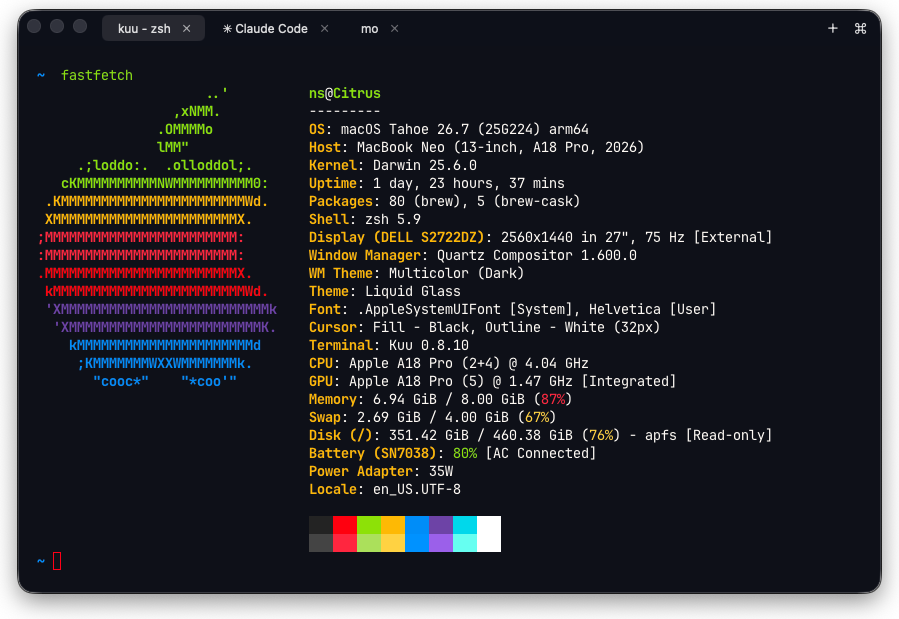
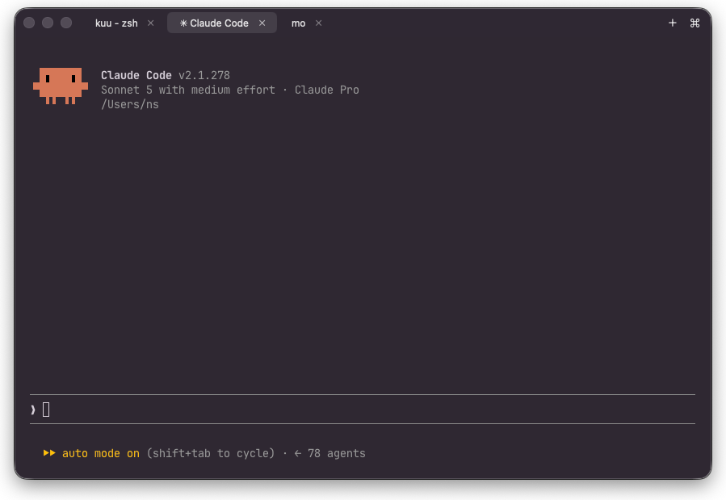
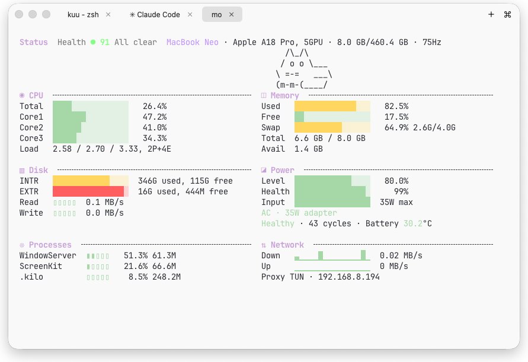
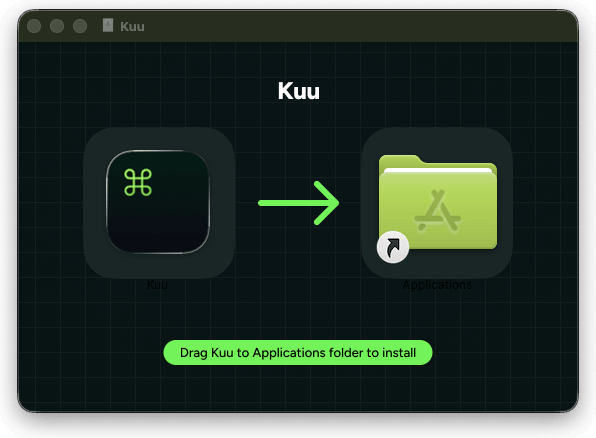
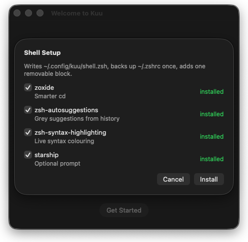
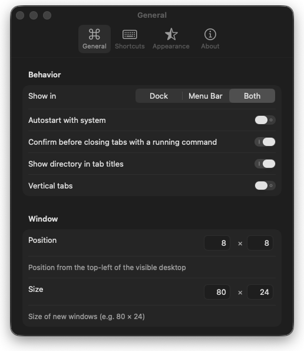

<h1 align="center">
  <br>
  Kuu
</h1>

<p align="center">
  A fast, native macOS terminal with real Settings panes.<br>
  Real login shells on a Metal surface. No account, no telemetry.
</p>

<p align="center">
  
</p>

<p align="center">
  <a href="https://github.com/tretten/kuu/releases/latest"></a>
  
  
</p>

## Features

- Real PTY login shells, rendered by Ghostty on Metal.
- Windows and tabs (⌘N / ⌘T / ⌘W), with scroll arrows when tabs overflow and an optional full-height vertical rail.
- Tab titles show the running command with a directory prefix, and closing a tab with a live process asks first.
- Themes from the GhosttyTheme catalog, light and dark, set globally or per tab.
- Pinned tabs, renamed tabs, color-coded tabs.
- Font family, size, weight, and line height, plus per-tab zoom (⌘+ / ⌘− / ⌘0).
- Find in scrollback with ⌘F.
- Links in the terminal open in your browser.
- Window padding, starting position, and character-grid size.
- A plain config file, if you would rather type than click.

<p align="center">
  <br>
  
</p>

## Install

Requires macOS 15.6 or later.

**Homebrew**

```sh
brew tap tretten/kuu
brew install --cask kuu
```

**Manual**

Download `Kuu.dmg` from [Releases](https://github.com/tretten/kuu/releases/latest) and drag `Kuu.app` into Applications. Builds are signed with a Developer ID certificate and notarized, so Gatekeeper lets them through without complaining.

<p align="center">
  
</p>

Updates arrive on their own through Sparkle, so there is nothing to re-download later.

On first launch Kuu offers to install its shell additions. They are optional and you can skip them.

<p align="center">
  
</p>

## Configure

Press ⌘, for Settings: General, Shortcuts, Appearance, and About.

<p align="center">
  
</p>

The same settings live in `~/.config/kuu/config.yml`. Edit it in any editor, press ⌘⇧, inside Kuu, and the changes take effect. No restart.

## Keyboard shortcuts

| Action | Shortcut |
|---|---|
| New window | ⌘N |
| New tab | ⌘T |
| Close tab / window | ⌘W |
| Zoom in / out / reset | ⌘+ / ⌘− / ⌘0 |
| Find in scrollback | ⌘F |
| Settings | ⌘, |
| Reload config | ⌘⇧, |

## Privacy

Kuu collects nothing and sends nothing anywhere. The one exception is Sparkle checking for updates, and you can turn that off in Settings → About.

## FAQ

**macOS refuses to open the app.**
Make sure the build came from the [Releases](https://github.com/tretten/kuu/releases/latest) page. Those are signed and notarized, so Gatekeeper stays quiet.

**How do I uninstall it?**
Delete `Kuu.app` from Applications. Remove `~/.config/kuu` as well if you want the settings gone.

**Something looks off.**
Open an issue with your macOS version, the Kuu version from the About window, and the steps that got you there.

## License

MIT, see [LICENSE](LICENSE). Kuu builds on [Ghostty](https://ghostty.org) (also MIT), with code adapted from [0x96f/justty](https://github.com/0x96f/justty) and [tretten/screenkit](https://github.com/tretten/screenkit).

---

This repository hosts the signed release builds (DMG and ZIP) that feed the auto-updater.
