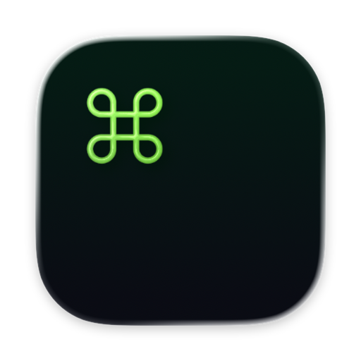

<h1 align="center">Kuu</h1>

<p align="center">
  
</p>

<p align="center">
  A minimal native macOS terminal. Real login shells on a Metal surface: windows, tabs, themes, and one plain config file.
</p>

<p align="center">
  <a href="https://github.com/tretten/kuu/releases/latest/download/Kuu.dmg">
    
  </a>
</p>

<p align="center">
  <a href="https://github.com/tretten/kuu/releases/latest"></a>
  <a href="https://github.com/tretten/kuu/releases/latest"></a>
  <a href="https://github.com/tretten/kuu/releases/latest"></a>
</p>

## Features

- Real PTY login shells through the Ghostty Metal renderer.
- Windows and tabs (⌘N / ⌘T / ⌘W), with scroll arrows when tabs overflow and an optional full-height vertical tab rail.
- Tab titles show the running command with a directory prefix. Closing a tab with a running process asks for confirmation first.
- Color themes from the GhosttyTheme catalog, in light and dark.
- Font family, size, weight, and line height, plus per-tab zoom (⌘+, ⌘−, ⌘0).
- Find in scrollback with ⌘F; terminal links open in your browser.
- Window padding, starting position, and character-grid size.
- Settings live in a plain file at `~/.config/kuu/config.yml`. Edit it by hand and press ⌘⇧, to reload.

## Install

Requires macOS 15.6 or later.

**Homebrew (recommended):**

```sh
brew tap tretten/kuu
brew install --cask kuu
```

The cask clears the quarantine flag automatically.

**Manual install:** download `Kuu.dmg` from [Releases](https://github.com/tretten/kuu/releases/latest) and drag `Kuu.app` to Applications. Builds are signed with a Developer ID certificate and notarized, so they open with no Gatekeeper warnings.

Updates arrive automatically via Sparkle. No need to re-download.

## Configure

Everything lives in one plain file: `~/.config/kuu/config.yml`.

Edit it in any text editor, then press ⌘⇧, inside Kuu to reload. No restart needed.

## Keyboard shortcuts

| Action | Shortcut |
|---|---|
| New window | ⌘N |
| New tab | ⌘T |
| Close tab / window | ⌘W |
| Zoom in / out / reset | ⌘+ / ⌘− / ⌘0 |
| Find in scrollback | ⌘F |
| Reload config | ⌘⇧, |

## Privacy

Kuu runs entirely on your Mac, with no account and no telemetry. The only connection it makes is the automatic update check (Sparkle).

## FAQ

**macOS refuses to open the app?**
Only download builds from the [Releases](https://github.com/tretten/kuu/releases/latest) page. They are signed and notarized, so Gatekeeper stays quiet.

**How do I uninstall?**
Delete `Kuu.app` from Applications. Optionally remove `~/.config/kuu` to clear settings.

**Something looks off?**
File an issue with your macOS version, Kuu version (from the About window), and steps to reproduce.

## License

MIT. Kuu builds on [Ghostty](https://ghostty.org) (also MIT), with code adapted from [0x96f/justty](https://github.com/0x96f/justty) and [tretten/screenkit](https://github.com/tretten/screenkit).

---

This repository hosts the signed release builds (DMG/ZIP) for the auto-update feed. It does not contain source code.
